<div align="center">

[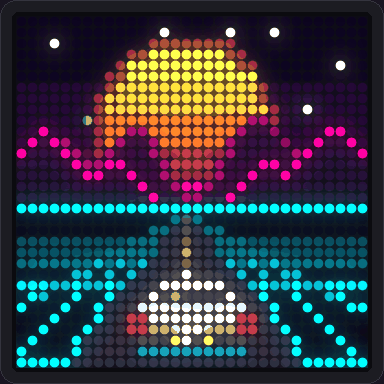](docs/media/hero.gif)

# 🟧 DeskDot

### Turn your iDotMatrix into a live desktop companion — the all-in-one app for your iDotMatrix.

90+ apps, 22 multiplayer games, live data from 45+ free sources, a studio for your browser and phone,<br/>
and an MCP server so AI agents like Claude can see the panel and drive it.

_1,024 pixels. Zero subscriptions._

[](https://github.com/shivpatel2468/idotmatrix/actions/workflows/ci.yml)
[](LICENSE)
[](pyproject.toml)
[](web)
[](docs/MCP.md)
[](https://idotmatrix.com)

**[Quick Start](#-quick-start) · [First Five Minutes](#-the-first-five-minutes) · [The Studio](#-the-studio) · [Games](#-games--multiplayer) · [Talk to It](#-talk-to-it--ai-agents--mcp) · [Live Data](#-whats-on-the-panel) · [Spec Sheet](#-spec-sheet--the-idotmatrix-panel) · [Under the Hood](#-under-the-hood) · [What's Next](#-whats-next)**

</div>

> [!NOTE]
> **DeskDot is an independent, community-built project.** It is not affiliated with, endorsed by or supported by
> the makers of iDotMatrix. "iDotMatrix" is used only to say which panels it works with; all trademarks belong to
> their owners. DeskDot talks to your own panel over Bluetooth, and nothing is sent to the manufacturer.

* * *

## 🔲 Why This Exists

The iDotMatrix is a lovely little 32×32 RGB pixel frame. Out of the box, its phone app lets you push a picture or a
GIF and walk away. DeskDot turns the same panel into something that's **alive**:

- a clock that knows your calendar;
- weather for where you actually are;
- your music with karaoke lyrics;
- a flight radar of the planes overhead;
- a Claude mascot that mirrors what your AI agent is doing;
- games your friends join by scanning a QR code;
- a rotating playlist of all of it, running all day.

It's built for the panel's real physics. Every rule about Bluetooth pacing, flow control, GIF budgets and colour
calibration was measured on the hardware ([HARDWARE_PROTOCOL.md](docs/HARDWARE_PROTOCOL.md)). It's also built so
that anyone, including an AI agent, can make a new app in one Python file.

> _Half the fun is that it looks like a toy. The other half is that it's a real-time engine with 4,400 tests._

* * *

## 🎛️ What It Does

*   **🧠 One engine, one link:** an async Python engine owns the panel's single Bluetooth connection.
    *   Its scheduler is "latest frame wins", with paced packets and ack flow control.
    *   It reconnects on its own and never shows the pairing screen by accident.
*   **🖼️ 90+ apps:**
    *   clocks, weather, markets, sports, space, quakes, flights, air quality and system stats;
    *   pets, generative art, 3D wireframes, a raycaster and falling sand;
    *   chess puzzles, trivia, a pixel canvas, text and fonts.
    *   They're all original pixel art, with no copied sprites.
*   **🎮 25 games, 21 with real multiplayer:** 2–4 players on the same Wi-Fi.
    *   Friends scan a QR code on the panel and their phone becomes the controller.
    *   There's a FIFA-style side select, plus intro screens, results screens and a red damage flash.
*   **🎰 Casino night:** 10 real casino games for a party around the panel: Roulette (European / American),
    7 Up 7 Down, Blackjack, Baccarat, Slots (pull the lever on your phone), Texas Hold'em, Teen Patti, Andar Bahar,
    the Big Six wheel and Housie (Tambola: the tickets on your phone, the caller on the panel).
    - Friends join with the QR code; the host sets everyone's credits.
    - The panel shows only the table, while phones show credits, the betting layout and private cards.
    - Every round is provably fair, with commit–reveal and "Verify this round", and pays by the real rulebooks.
    - 21 table themes with their own felt patterns (from classic green and royal blue to Imperial jade, Gilded deco,
      Festival of lights, Cyber grid, Sakura night and Galaxy) recolour the panel, every phone, the studio and the TV;
      a "?" on every phone opens How to play, the rulebook and the payouts, with a guided tour for new players.
      See [docs/CASINO.md](docs/CASINO.md) and the player's rulebook [docs/CASINO_RULES.md](docs/CASINO_RULES.md).
*   **📺 TV view:** put any screen in the room on it — a smart-TV or Fire TV browser, a tablet, a projector. Studio →
    Create → Show on TV → scan. A 1920 × 1080 broadcast: the full casino table with everyone's chips, the wheel
    synced to the panel, game scoreboards and the live panel. See [docs/TV_VIEW.md](docs/TV_VIEW.md).
*   **✊ Rock Paper Scissors:** AI vs AI, you vs AI, 1v1 or a 3–8 player tournament, with pixel-hand pickers on phones.
*   **🌐 No install:** open [idotmatrix.com/app](https://idotmatrix.com/app/) in Chrome or Edge and connect the panel
    over Web Bluetooth. The same engine runs in your browser. See [docs/WEB_APP.md](docs/WEB_APP.md).
    *   Friends scan the same QR code; their phone shows their credits and the betting table, the panel shows the wheel.
    *   The host sets everyone's credits. Every round is provably fair (commit–reveal) and phones verify it themselves.
*   **🎞️ Baked native loops:** deterministic animations are rendered once and stored on the panel as GIFs, so they
    play butter-smooth with no Bluetooth traffic at all.
*   **🎨 A studio for every screen:**
    *   a desktop studio with a live LED preview (glow, pixel or LED look, with a sharpness setting);
    *   a library and playlists;
    *   per-app settings generated from schemas;
    *   a phone layout with touch controls.
*   **🤖 AI-native:**
    *   An MCP server gives agents 21 tools: see the panel, show apps, draw pixel art, notify, run the playlist.
    *   A Claude Code hook lights the panel up while your agent works.
*   **🌍 Location-aware, key-free:** weather, sunrise, flights, quakes and air quality all follow your location.
    Almost every data source needs no key at all ([details](#-api-keys--costs)).
*   **🔌 Hand-off:** when the computer sleeps or exits, the panel switches to its own built-in clock or a baked loop,
    so it never freezes on a stale frame.
*   **🪰 A fruit-fly brain that plays:** a model of the fly's real visual circuit (the one FlyWire's
    connectome maps) sees the panel's pixels and plays any game, or lives in its own app.
    [How it works](docs/FLY_BRAIN.md).
*   **📱 Runs anywhere with Bluetooth:** a laptop, a Raspberry Pi, or a spare Android phone (🧪 beta app).

| What you get | Count | Details |
| --- | --- | --- |
| Apps | **90** | time, live data, media, pets, games, creative, focus & agents, ambient |
| Games | **25** | every one with an AI that plays itself; most with 2–4 player modes, maps and themes |
| Live data sources | **45+** | Open-Meteo, USGS, adsb.lol, Launch Library 2, ESPN, Binance, Yahoo Finance and more |
| Phone controller layouts | **7** | d-pad, analog stick, swipe, tap zones, keyboard, gamepad, tilt |
| MCP tools | **21** | `panel_snapshot`, `show_app`, `draw_pixel_art`, `notify`, `agent_state`, `playlist`… |
| Automated tests | **4,400+** | protocol bytes, every app × every option, games, studio API, Android bridge |

* * *

## 🖼️ The Apps

[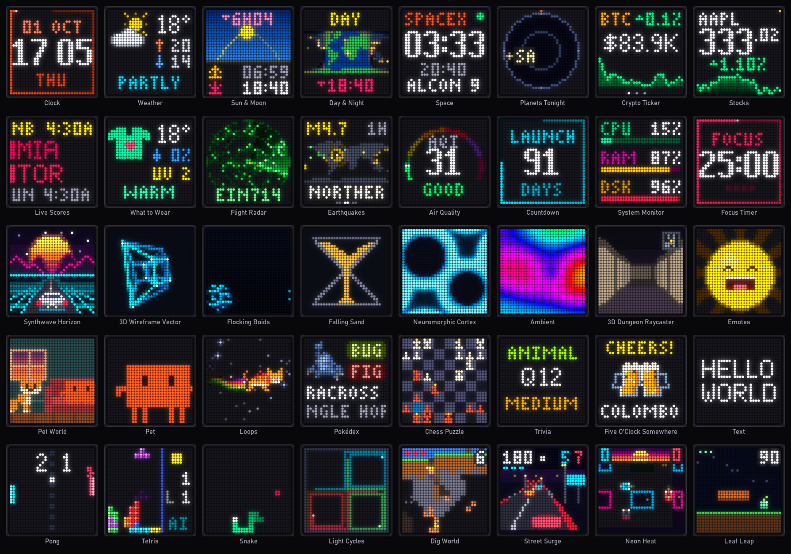](docs/media/apps-grid.png)

| | Category | Apps |
| --- | --- | --- |
| 🕐 | **Time** | Clock (analog, digital, hero), Countdown, Day & Night world map, Five O'Clock Somewhere, Holidays, Progress, Sun & Moon |
| 📡 | **Live data** | Weather, What to Wear, Air Quality, Rain Radar, Earthquakes, Flight Radar, Tides & Surf, Planets Tonight, Space, Crypto Ticker, Stocks, Currency, Live Scores, Headlines, GitHub Graph, System Monitor, Home Assistant |
| 🎵 | **Media** | Now Playing (album art, vinyl, karaoke lyrics), Visualizer, Photo Frame, Gallery, Media Server, Screen & Camera Mirror |
| 🐾 | **Pets & characters** | Pet World (rooms, park, football), Pet, Pokédex, Pixel Avatar |
| 🎮 | **Games** | Pong, Breakout, Flappy, Dino, Racer, Snake, Tetris, 2048, Invaders, Maze Chase, Asteroids, Infinity, X and 0, Four Up, Mines, Starship, Light Cycles, Dig World, Neon Heat, Street Surge, Leaf Leap, Penguin Escape, Chess Puzzle, Trivia |
| 🎨 | **Creative** | Fly Brain 🪰, Synthwave Horizon, 3D Wireframe, Flocking Boids, Falling Sand, Neuromorphic Cortex, Raycaster, Emotes, Pixabots, Text, Font Lab, Canvas, Player Card, Composer |
| 🎯 | **Focus & agents** | Agent (Claude mascot), Focus Timer, Focus Pet, Eye Break, On Air, Calendar, Habits, Anki, Active App, CI radiator, OBS, Uptime, 3D Printer |
| 🌌 | **Ambient** | Ambient (rain, snow, plasma, fireworks…), Loops |

<table>
<tr>
<td align="center">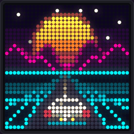<br/><sub><b>Synthwave Horizon</b></sub></td>
<td align="center">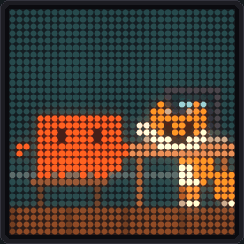<br/><sub><b>Pet World</b></sub></td>
<td align="center">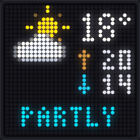<br/><sub><b>Weather</b></sub></td>
<td align="center">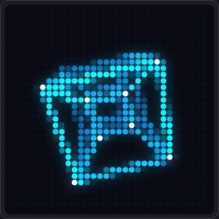<br/><sub><b>3D Wireframe</b></sub></td>
</tr>
<tr>
<td align="center">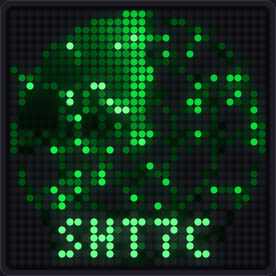<br/><sub><b>Flight Radar</b></sub></td>
<td align="center">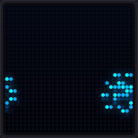<br/><sub><b>Flocking Boids</b></sub></td>
<td align="center">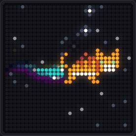<br/><sub><b>Loops</b></sub></td>
<td align="center">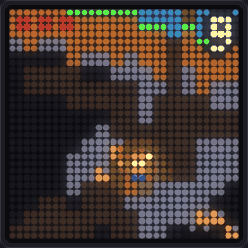<br/><sub><b>Dig World</b></sub></td>
</tr>
</table>

<sub>All media in this README is rendered by DeskDot itself from the simulated panel, drawn with an LED-panel look.</sub>

* * *

## ⚡ Quick Start

**You need:** an iDotMatrix 32×32 panel, a computer with Bluetooth LE, [uv](https://docs.astral.sh/uv/) (it installs
Python 3.13 for you) and Node.js 20+ (only to build the studio once). **Close the iDotMatrix phone app first**: the
panel accepts one Bluetooth connection at a time.

```bash
git clone https://github.com/shivpatel2468/idotmatrix.git deskdot
cd deskdot
uv sync --extra mcp                    # engine + MCP server
(cd web && npm ci && npm run build)    # the studio, built once
uv run deskdot scan                    # find your panel (IDM-xxxxxx)
uv run deskdot doctor                  # draws a test pattern on it
uv run deskdot serve                   # → open http://127.0.0.1:8765
```

No panel yet? `uv run deskdot serve --sim` runs everything against a simulated panel.

<details>
<summary><b>🍓 Always on: Raspberry Pi (recommended host)</b></summary>

A Pi Zero 2 W / 3 / 4 / 5 has built-in Bluetooth LE and runs DeskDot at 1–3 W, 24/7.

```bash
# on your computer: build the studio, then copy the folder over
(cd web && npm ci && npm run build)
scp -r . pi@raspberrypi.local:~/deskdot
# on the Pi
cd ~/deskdot && bash scripts/install-pi.sh   # installs uv + a systemd service
```

Then open `http://raspberrypi.local:8765` from any device on your Wi-Fi. More hosts and trade-offs:
[docs/DEPLOY.md](docs/DEPLOY.md).
</details>

<details>
<summary><b>📱 Always on: a spare Android phone (🧪 beta)</b></summary>

The **DeskDot Android app** runs the whole Python engine on the phone (via Chaquopy) as a foreground service. It keeps
the panel connected with the screen off, restarts itself after a reboot, and shows the studio full screen.

> [!WARNING]
> The app builds and its Bluetooth bridge is unit-tested, but it has **not yet been run on a real phone**.
> Build and install steps are in [android/README.md](android/README.md).
</details>

<details>
<summary><b>⚙️ Configuration</b></summary>

Copy [`deskdot.example.toml`](deskdot.example.toml) to `deskdot.toml`; it's git-ignored, so it never leaves your
machine. Every key can also be set as an environment variable (`DESKDOT_<KEY>`). The two you'll care about:

```toml
address = "AA:BB:CC:DD:EE:FF"   # your panel's MAC from `deskdot scan` (empty = first IDM-* found)
lan_studio = false              # true = open the full studio to other devices on your Wi-Fi
```
</details>

* * *

## 🕐 The First Five Minutes

1. **Pick an app** in the library on the left. It plays on the panel within a second, and the big preview in the
   middle shows exactly what the LEDs show.
2. **Tweak it** in the panel on the right. Every setting is live, and every app's form is generated from its schema.
   Drag the glowing edge to resize the panel; the form re-flows to fit.
3. **Tap a preset** in the dock ("Desk dashboard", "Chill", "All games"…) to rotate apps on a timer, or build your
   own playlist. Drag the dock's glowing top edge to make it taller, or press ⤢ for a full-screen now-playing view.
4. **Press ▶ Play on any game.** The AI is playing; touch an arrow key and you take over instantly. Press
   **B** for the game's menu (modes, players, map, theme).
5. **Play with friends.** Choose *Play with friends*, the panel shows a QR code, and your friends' phones become
   controllers.
6. **Run the colour wizard** (Settings → Display & colour). Five questions while looking at your panel, and photos,
   album art and GIFs are colour-matched to it.

* * *

## 🎨 The Studio

<table>
<tr>
<td width="50%"><a href="docs/media/studio.png">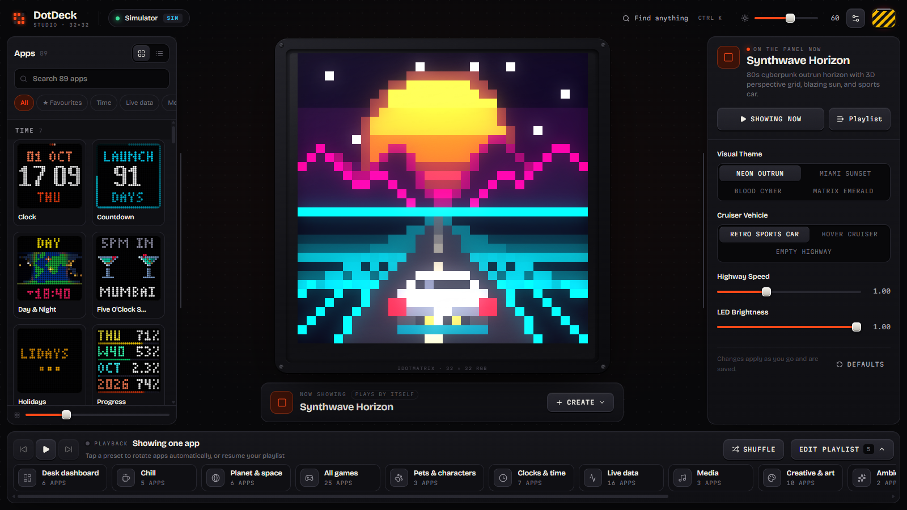</a><br/><sub><b>Library · live preview · settings.</b> The preview mirrors the LEDs; the right panel is resizable.</sub></td>
<td width="50%"><a href="docs/media/studio-play.png">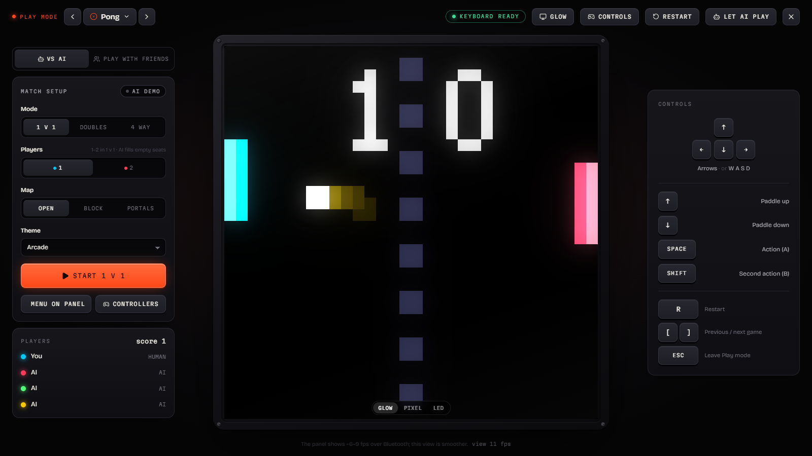</a><br/><sub><b>Play mode.</b> Match setup (mode, players, map, theme), keyboard and gamepad controls.</sub></td>
</tr>
<tr>
<td width="50%"><a href="docs/media/studio-multiplayer.png">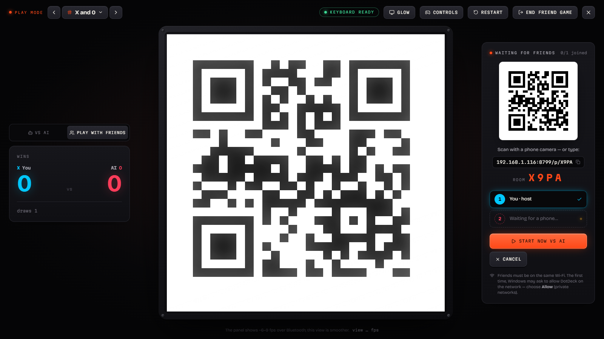</a><br/><sub><b>Play with friends.</b> A QR code on the panel; phones join in a second.</sub></td>
<td width="50%"><a href="docs/media/studio-settings.png">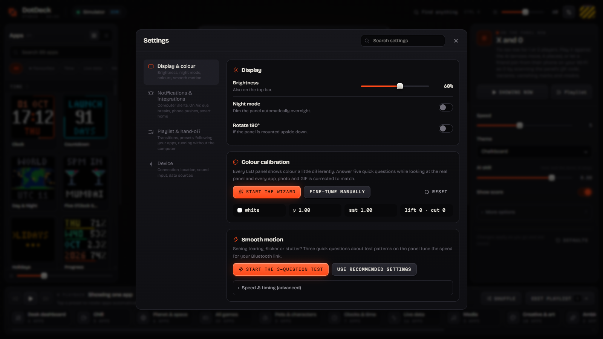</a><br/><sub><b>Settings.</b> Brightness, night mode, the colour-calibration wizard, link tuning.</sub></td>
</tr>
</table>

<div align="center">

[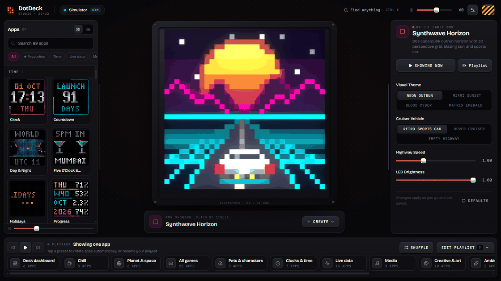](docs/media/studio-tour.gif)

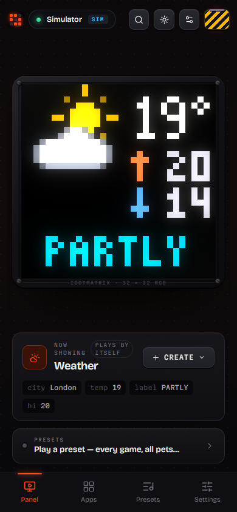&nbsp;&nbsp;&nbsp;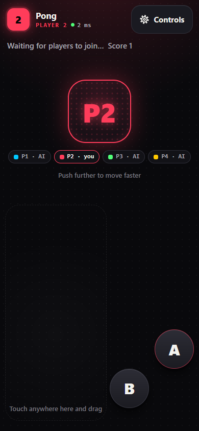

<sub>The studio on a phone (bottom tabs) · the game controller friends get after scanning the QR code.</sub>

</div>

* * *

## 🎮 Games & Multiplayer

Every game plays itself when nobody is touching it, so they make great screensavers. When you press a key, you're
in.

<table>
<tr>
<td align="center">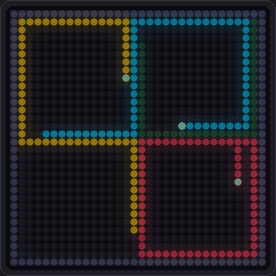<br/><sub><b>Light Cycles</b>: 4 riders, teams, arenas</sub></td>
<td align="center">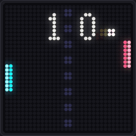<br/><sub><b>Pong</b>: 1v1, doubles, 4-way</sub></td>
<td align="center"><br/><sub><b>Dig World</b>: mine, build, survive the night</sub></td>
</tr>
</table>

- **Modes for 1–4 players:** versus, co-op, free-for-all and team modes. Classics get fun modes too: Snake battle
  royale, Tetris garbage duels, a maze chase where your friends *are* the ghosts, Flappy and Dino races.
- **Home menu on the panel** (press **B**): mode, players, map and theme. There's a **FIFA-style side select** where
  each controller moves left or right to pick a team (1v1, 2v1, 2v2), plus an intro countdown, a results screen and
  a red damage flash.
- **Maps and genre themes** for every game. A test checks that gameplay colours never blend into the background.
- **Controllers:** keyboard (two players can share one), gamepads (Xbox / PlayStation / Switch via the browser), and
  phones with seven layouts. Friends just need the same Wi-Fi: only the controller pages are reachable from the
  network, not the studio.

| Controller | Where | Best for |
| --- | --- | --- |
| ⌨️ Keyboard | studio | everything (arrows / WASD + Space / Shift) |
| 🎮 Gamepad | studio | racers, platformers (standard browser mapping) |
| 🕹️ Analog stick | phone | Pong, Asteroids, Neon Heat |
| ✛ D-pad | phone | Tetris, X and 0, Four Up, Mines |
| 👆 Swipe | phone | Snake, Light Cycles, 2048 |
| 👇 Tap zones | phone | Flappy, Dino, Street Surge |
| 📐 Tilt | phone (HTTPS only) | racing |

* * *

## 🤖 Talk to It — AI agents & MCP

DeskDot ships an **MCP server**, a thin client over the engine's HTTP API, so Claude Code, Claude Desktop or any MCP
client can **see the panel and drive it**:

```json
{ "mcpServers": { "deskdot": { "command": "uv", "args": ["run", "--project", "/path/to/deskdot", "deskdot-mcp"] } } }
```

| Tool | What the agent can do |
| --- | --- |
| `panel_snapshot` | look at what's on the LEDs right now (as an image) |
| `list_apps` · `show_app` · `update_app_settings` · `app_action` | run any app, change any setting |
| `show_text` · `draw_pixel_art` · `set_pixels` · `show_image` · `compose` | put anything on the panel |
| `notify` · `set_indicator` · `push_custom_app` | alerts, status LEDs, AWTRIX-style custom apps |
| `agent_state` | drive the Claude mascot (thinking, working, waiting for you, done) |
| `playlist` · `set_playlist` · `presets` · `autopilot` · `set_display` · `panel_status` | run the show |

The [Claude Code hook](integrations/claude-code) makes the mascot react to your coding session in real time.
Details: [docs/MCP.md](docs/MCP.md). New apps are one file each: [docs/APP_SDK.md](docs/APP_SDK.md).

**A search bar for the whole desk:** `uv run deskdot launcher` puts a Spotlight-style command bar on
**Ctrl+Alt+Space** (apps with live previews, presets, games, brightness, "let the fly play"); on a Mac there's the
native **DeskDot Bar** menu-bar app, and a **Raycast** extension for both. See [docs/LAUNCHERS.md](docs/LAUNCHERS.md).

* * *

## 📡 What's on the Panel

Location-aware apps follow one shared location: your setting, or a city lookup, or IP geolocation.
<sub>(🟢 no key · 🟡 optional key or local service · 🔴 paid)</sub>

| Layer | What you get | Source | Auth |
| --- | --- | --- | --- |
| 🌦️ **Weather · Wear · Air** | conditions, forecast, AQI, UV, pollen, what to wear | Open-Meteo | 🟢 |
| 🌧️ **Rain Radar** | animated precipitation over your area | RainViewer + Open-Meteo Elevation | 🟢 |
| ✈️ **Flight Radar** | aircraft overhead on a radar scope | adsb.lol, OpenSky | 🟢 |
| 🌋 **Earthquakes** | world map + "near me" alerts | USGS | 🟢 |
| 🚀 **Space** | next launch countdown, ISS, people in space | Launch Library 2, wheretheiss.at | 🟢 |
| 🌅 **Sun & Moon · Planets** | sunrise, golden hour, moon phase, planets tonight | computed locally + sunrise-sunset.org | 🟢 |
| 🌊 **Tides & Surf** | tide curve, swell | Open-Meteo Marine | 🟢 |
| 📈 **Crypto · Stocks · Currency** | tickers, sparklines, converter | Binance, Yahoo Finance / Stooq, Frankfurter | 🟢 |
| 🏏 **Live Scores** | football, cricket, NBA, F1… | ESPN public scoreboards | 🟢 |
| 📰 **Headlines · Daily · Trivia** | HN, dev.to, quotes, jokes, facts, quizzes | Hacker News, ZenQuotes, Open Trivia DB… | 🟢 |
| 🎵 **Now Playing · Lyrics** | album art, karaoke lyrics | your OS media session, LRCLIB | 🟢 |
| 🖼️ **Photo Frame · Pokédex** | museum art, animals, Pokémon sprites | The Met, Cleveland Museum, PokéAPI… | 🟢 |
| 🧑‍💻 **GitHub · CI** | contribution graph, build radiator | GitHub API | 🟡 token optional |
| 🏠 **Home Assistant · OBS · Printer · Anki · Media Server** | entities, on-air, print progress, reviews | your own services | 🟡 local |

The full list, with the APIs we tried and rejected (and why): [DATA_SOURCES.md](DATA_SOURCES.md).

* * *

## 💡 Use Cases

| You are… | DeskDot becomes… |
| --- | --- |
| 🧑‍💻 **A developer** | a CI radiator, a GitHub graph, a Claude mascot that tells you when your agent needs you, a Pomodoro |
| 🎧 **Working from home** | an "On Air" light for calls, a calendar countdown, eye-break reminders, a focus pet |
| 🎮 **Hosting friends** | a 4-player arcade on the coffee table, with phones as controllers |
| 🏡 **A smart-home tinkerer** | a Home Assistant status screen, ntfy alerts from anywhere, AWTRIX-compatible custom apps |
| 🎨 **A pixel artist** | a canvas, a font lab, a GIF/photo frame with real colour calibration |
| 🌍 **A data nerd** | a wall of live flights, quakes, launches, markets and weather |
| 🤖 **Building with AI** | a physical display your agent can draw on, notify through and check with a snapshot |

* * *

## 🧩 Compatibility

| Host | Status | Notes |
| --- | --- | --- |
| **Windows 10/11** | ✅ Verified on hardware | Bluetooth LE via WinRT; sleep/wake hand-off |
| **Raspberry Pi OS / Debian / Ubuntu** | 🟡 Supported, installer untested on a real Pi | BlueZ; `scripts/install-pi.sh` sets up a systemd service |
| **macOS** | 🟡 Should work, untested | CoreBluetooth hides MAC addresses, so DeskDot finds the panel by its `IDM-` name |
| **Android 8+ (64-bit)** | 🧪 Beta, not yet run on a phone | the [Android app](android/README.md) runs the whole engine on the phone |
| **iPhone / iPad** | ❌ as a host | iOS suspends background apps; use it as a studio or controller instead |
| **Any browser** | ✅ Studio & controller | Chrome, Edge, Firefox, Safari; gamepads in desktop browsers |

What works where — every app, provider and setting per OS, plus studio and phone-controller browsers: **[docs/COMPATIBILITY.md](docs/COMPATIBILITY.md)**. The studio greys out what this host can't do.

| Panel | Status |
| --- | --- |
| iDotMatrix **32×32** RGB (advertises `IDM-xxxxxx`) | ✅ Verified |
| Other iDotMatrix sizes (16×16, 64×64) | ❓ Untested; the protocol is shared, but every app is designed for 32×32 |

* * *

## 📐 Spec Sheet — the iDotMatrix panel

What DeskDot measured on a real unit (Windows 11, 2026-09-24 → 2026-10-01). Vendor specs vary by seller; these are
the numbers that matter to software.

| Property | Value |
| --- | --- |
| Display | 32 × 32 RGB LEDs (1,024 pixels), origin top-left |
| Brightness | 5–100 %, plus screen on/off, flip 180°, night (eco) mode |
| Connection | Bluetooth LE; advertises as `IDM-xxxxxx`; **one central at a time** |
| GATT | write `0000fa02-…`, notify `0000fa03-…` (acks used for flow control) |
| Packet size | up to 514 B per write (MTU 517); messages split into 4 KiB chunks |
| Live frames | PNG in DIY mode: **~9 fps** for simple frames (1 packet), **~5–6 fps** for full scenes |
| Native animation | GIFs stored on the panel and looped by its own firmware: smooth at **≤ 10 fps**, 240+ frames, **≤ 40 KB** |
| GIF upload | ~16 KB/s; one ack per 4 KiB chunk |
| Built-in modes | clock (8 styles), countdown, chronograph, scoreboard, effects, solid colour |
| Quirks DeskDot handles | pairing screen on disconnect · DIY-mode blink · panel freezes if GIFs arrive too often · unpaced bursts silently dropped · photos need gamma + white-balance calibration |

<details>
<summary><b>📋 How DeskDot keeps the link healthy</b></summary>

- **Paced packets.** An unpaced burst of writes is silently dropped, so there's an 18 ms gap between packets.
- **One frame in flight.** Waiting for every ack gives ~2.6 fps, while pipelining one frame gives ~9 fps.
- **Latest frame wins.** Frames are never queued FIFO; a newer frame replaces an unsent one.
- **GIF uploads are never abandoned mid-way** (that blanks the panel), and they cool down for 3 s between uploads
  (frequent uploads freeze the firmware).
- **Never disconnect voluntarily.** The device layer reconnects with backoff.

Byte-level reference: [docs/HARDWARE_PROTOCOL.md](docs/HARDWARE_PROTOCOL.md).
</details>

* * *

## 🔧 Under the Hood

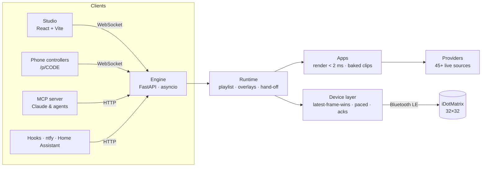

```
src/deskdot/
├── engine/        # runtime, scheduler, playlist, presets, hand-off, app base classes
├── device/        # the only code that touches Bluetooth: protocol bytes, BLE, Android bridge, simulator
├── apps/          # 90 apps — one file each (games in games_*.py on a shared GameApp framework)
├── providers/     # live data: weather, flights, quakes, markets, sports, media, system…
├── gfx/           # Frame primitives, bitmap fonts, colour calibration, GIF encoder, world map, sprites
├── server.py      # HTTP + WebSocket API (docs/API.md)
├── multiplayer.py # lobby, QR rooms, LAN gate, phone controller
└── mcp_server.py  # MCP tools over the HTTP API
web/               # the studio (React 19 + TypeScript + Tailwind v4)
android/           # the Android host app (Kotlin + Chaquopy)
tests/             # 4,400+ tests — every app × every option renders without data
```

**The rules that keep it smooth** (enforced by tests and [CLAUDE.md](CLAUDE.md)):
- **Nothing leaves the 32×32 grid**, and `render()` is pure and under 2 ms.
- **Loops are baked clips**; only live data streams.
- **1-bit bitmap fonts only.**
- **Design colours are for LEDs; photos get calibrated once.**
- **Settings are pydantic models**, so the studio builds every form from the schema.

Decisions and why: [docs/adr/](docs/adr/).

* * *

## 🔑 API Keys & Costs

**Nothing here costs money, and you need no key to start.** Every built-in data source is free and keyless. Keys or
local services only come in when you connect *your own* things:

| Provider | Why | Get it |
| --- | --- | --- |
| GitHub token (optional) | higher rate limit for GitHub Graph / CI | [github.com/settings/tokens](https://github.com/settings/tokens) (read-only) |
| Home Assistant | show entities, control DeskDot from automations | a long-lived token from your HA profile |
| OBS · AnkiConnect · OctoPrint/Moonraker · Jellyfin/Plex | on-air light, reviews, print progress, now watching | your local service |
| Gemini (optional) | "Draw with AI" in the studio | [aistudio.google.com](https://aistudio.google.com/) |

Secrets are typed into the studio. They're stored only in `data/state.json` on your machine (git-ignored), masked
(`••••••`) in every API response and snapshot, and never logged.

* * *

## 📋 Responsible & Open

- **Local-first.** DeskDot runs on your computer, Pi or phone. There's no account, no cloud and no telemetry.
- **LAN-closed by default.** Other devices on your Wi-Fi can only reach the game-controller pages; set
  `lan_studio = true` to open the full studio.
- **No copied assets.** All pixel art, characters and fonts are original. Photos and sprites (museum art, Pokémon)
  are fetched at runtime from their public APIs, never bundled.
- **Not affiliated with iDotMatrix's maker.** See the note at the top. Found a security issue? See
  [SECURITY.md](SECURITY.md).

* * *

## 🧭 What's Next

### 🪰 A fruit-fly brain that plays the apps — first version is in

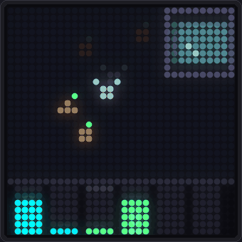

The headline goal: **wire DeskDot to the first complete map of an adult fruit-fly brain.**

In October 2024 the FlyWire consortium, a Princeton-led team whose AI reconstruction and 3D viewer were built with
Google Research, published the whole-brain *connectome* of *Drosophila melanogaster* in *Nature*: **139,255 neurons
and about 54.5 million synapses**, every connection traced.

The plan is a simplified spiking simulation of that wiring:
- **What it sees:** the panel's 32×32 frame goes into the fly's visual system, like a compound eye.
- **What it does:** its descending motor neurons steer Snake, Flappy or Racer.
- **What you see:** the panel shows only the game; the studio shows the brain itself, in 3D, firing as it plays.

You could play *against a fly*, watch it learn which inputs matter, or let it interact with any app.

**What's already here:**
- **The Fly Brain app:** a fly hunts fruit and dodges a looming swatter.
- **A "Fruit-fly brain" pilot for every game.**
- **The 3D Fly view in the studio:** when a fly starts playing, the side panels slide shut and two live 3D scenes
  open beside the panel:
  - **Left:** its visual circuit, layer by layer, with signals travelling the wiring and every spike flashing.
  - **Right:** a 3D fruit fly on a mechanical keyboard, stomping each key its neurons press, plus a keystroke log.

  Quality presets (Auto adapts to your GPU), bloom, particles, themes, cameras, fly looks and keyboard styles are all
  in **Graphics**.

[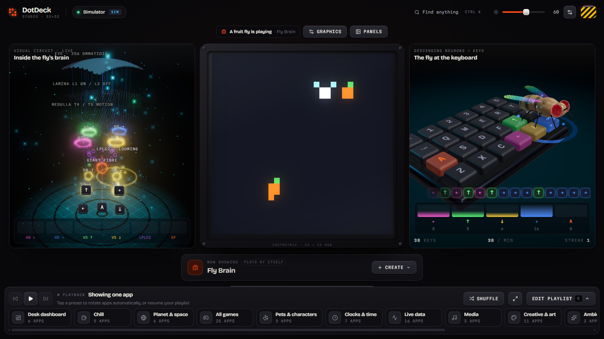](docs/media/studio-flyview.png)

Both are driven by a real-time model of exactly this circuit: T4/T5 motion detectors, HS/VS cells, LPLC2 → giant
fibre, and descending neurons. It sees nothing but the pixels. Its wiring is modelled on the circuit, not yet
loaded from FlyWire's synapse counts. That's the next step, explained in [docs/FLY_BRAIN.md](docs/FLY_BRAIN.md).

<sub>Sources: [FlyWire](https://flywire.ai/) · [Nature, 2 Oct 2024](https://www.nature.com/nature/volumes/634/issues/8032) · [NIH Research Matters](https://www.nih.gov/news-events/nih-research-matters/complete-wiring-map-adult-fruit-fly-brain)</sub>

### Also on the roadmap
- 📱 **Android app** out of beta: tested on real phones, with an APK on the Releases page.
- 🍓 **Raspberry Pi image**: flash it, plug it in, done.
- 🧩 **ESP32 bridge**: a Wi-Fi→BLE puck that plays baked loops from a DeskDot server.
- 🎙️ **Voice**: "show the weather", "start a 25-minute focus", from Alexa or Google via Home Assistant.
- 🖥️ **Bigger panels**: layouts for 64×64 iDotMatrix units.

More: [docs/ROADMAP.md](docs/ROADMAP.md) · [docs/IDEAS.md](docs/IDEAS.md).

* * *

## 📚 Documentation

| Need | Start here |
| --- | --- |
| Run it somewhere always-on | [docs/DEPLOY.md](docs/DEPLOY.md) |
| Write your own app | [docs/APP_SDK.md](docs/APP_SDK.md) · [plugins/_example_countdown.py](plugins/_example_countdown.py) |
| Design for 32×32 | [docs/DISPLAY_DESIGN.md](docs/DISPLAY_DESIGN.md) |
| HTTP & WebSocket API | [docs/API.md](docs/API.md) |
| Connect an AI agent | [docs/MCP.md](docs/MCP.md) |
| Search & control it from anywhere (hotkey launcher, macOS menu bar, Raycast) | [docs/LAUNCHERS.md](docs/LAUNCHERS.md) |
| How the engine fits together | [docs/ARCHITECTURE.md](docs/ARCHITECTURE.md) · [docs/adr/](docs/adr/) |
| The panel's Bluetooth protocol | [docs/HARDWARE_PROTOCOL.md](docs/HARDWARE_PROTOCOL.md) |
| The studio's design system | [docs/STUDIO_UI.md](docs/STUDIO_UI.md) |
| Contribute | [CONTRIBUTING.md](CONTRIBUTING.md) · [docs/CODING_STANDARDS.md](docs/CODING_STANDARDS.md) |

* * *

<div align="center">

**Built by [Shiv Patel](https://github.com/shivpatel2468)** · [idotmatrix.com](https://idotmatrix.com) · [MIT License](LICENSE)

If DeskDot made your desk a little more alive, a ⭐ helps other panel owners find it.

_1,024 pixels. Zero subscriptions._

</div>
