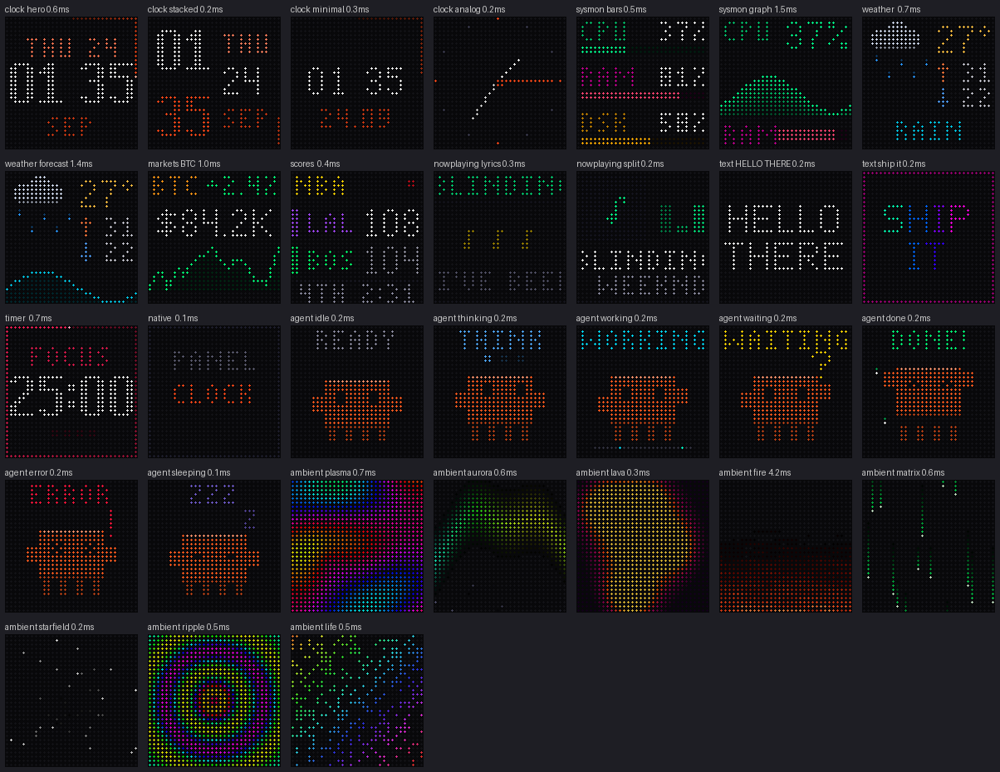

# Display design system — designing for 32 × 32

Everything on the panel follows this document. The studio's preview is LED-accurate, so design there and
confirm on hardware. Reference renders: [assets/apps.png](assets/apps.png) · type: [assets/fonts.png](assets/fonts.png).

## 1. The canvas

- 32 × 32 LEDs, `x, y ∈ [0, 31]`, origin top-left. **Black is off** — it is free contrast and saves power.
- **Margins:** text keeps ≥ 1 px from every edge (`x = 1 … 30`). Full-bleed art, bars and the edge ring
  may touch the edge.
- **Edge ring:** the 124-LED perimeter (`_kit.PERIMETER`) is a reserved progress channel (seconds, timers,
  playlist). Only one app element may use it at a time.
- **Safe composition grid** (tiny type): rows start at `y = 1, 7/8, 13/14, 19/20, 25/26`. Small type rows at
  `y = 1, 9/10, 18/19`, with 2–3 px leading.

## 2. Type scale

| Font | Cap height | Advance | Chars / 30 px | Use |
| --- | --- | --- | --- | --- |
| `tiny` | 5 px | 3 px (M/W 5, N 4) + 1 | ~7–8 | labels, units, secondary values, marquees |
| `small` | 7 px | 4–5 px + 1 | ~5–6 | the primary value on a screen, titles |
| `big` | 10 px, 2 px strokes | 6 px + 1 | `12:34` = 30 px | one hero number: time, timer, price |

Rules:
- All caps. Digits are tabular in every font — numbers never jitter as they change.
- One `big` or one `small` hero per screen; everything else `tiny`.
- Text that doesn't fit: `fit()` (ellipsis) for static labels, `draw_marquee()` for content (pauses 1.2 s at the start of
  each pass, loops seamlessly with a 12 px gap), `wrap()` for multi-line.
- Never centre text with odd widths by hand; use `text_center` / `text_right` (right edge = 30).
- `0` is square, `O` is round (tiny). Keep them distinct.

## 3. Colour

LEDs are additive and saturate hard. Author colours **for the panel**, from the tokens in `gfx/color.py`
(also served at `/api/meta` → `palette`, and shown as swatches in every colour picker).

| Role | Tokens |
| --- | --- |
| Brand / primary accent | `ember #ff4818` |
| Accents | `amber`, `gold`, `lime`, `mint`, `cyan`, `sky`, `blue`, `violet`, `magenta`, `rose`, `red` |
| Text | `white` (primary — use sparingly), `mute #8c8ca0` (secondary), `dim #46465a` (tertiary) |
| Structure | `shade #1c1c28` (tracks, dividers), `ink #0a0a10` (empty cells) |
| Semantic | `ok`, `warn`, `bad`, `info` |

Rules:
- **2–3 hues per screen**, plus white for the single most important value.
- Mid-greys read blue and muddy; use at most two neutral tones.
- Encode state with colour *and* position/shape (e.g. ▲/▼ plus green/red).
- Dim versions: `scale(c, k)`; blends: `mix(a, b, t)`. Never desaturate towards grey — dim instead.
- Team/brand colours from the web must be normalised for LEDs (`scores.led_team_color`).
- **Photos only**: `calibrate(img, "vibrant"|"natural")` (gamma 2.2, WB 1.0/0.88/0.82, black crush < 10).
  Pixel art is detected automatically and left raw.

### Dark tones and the panel calibration

The user's panel calibration uses gamma 1.5, which crushes dark colours: (44, 44, 54) comes out around
(19, 19, 26) — nearly invisible. **Keep meaningful dark tones above ~45–50 per channel** (terrain, cave interiors,
dim UI, "explored vs unexplored" distinctions), and reserve pure black for "nothing". Verified on hardware:
Dig World went from "fun but hard to see" to "much easier" after lifting stone to (92, 92, 108), dirt to
(140, 78, 32), explored caves to (46, 34, 28) and adding a warm glow around the player.

## 4. Composition patterns

Use one of these unless you have a reason not to:

| Pattern | Layout | Used by |
| --- | --- | --- |
| **Hero** | tiny label (y 4–5) · `big` value (y 11–12) · tiny caption (y 24–25) · optional edge ring | Clock hero, Timer |
| **Icon + stack** | 16×17 animated icon left · value column right (`small` + two `tiny`) · caption row | Weather |
| **Header + value + chart** | tiny header row with status right · `small` value centred · sparkline y 18–29 · page dots y 31 | Crypto |
| **Rows** | 3 rows × (tiny label left, value right, 2 px bar) at y 1 / 12 / 23 | System Monitor |
| **Scoreboard** | tiny header · two team rows (colour tab x 0–1, tiny abbr, `small` score right) · divider · marquee | Scores |
| **Full-bleed** | art fills 32×32, darken bottom 9 rows ×0.18 for a caption marquee, 1 px progress at y 31 | Now Playing cover |
| **Character** | 16×12 sprite centred, label row on top, props in the free corners | Claude Mascot |

## 5. Motion

Hardware limits first (measured with the user watching the panel — docs/HARDWARE_PROTOCOL.md #9–16):

| Limit | Rule |
| --- | --- |
| Streaming full scenes reaches only ~5–6 fps (two-packet frames) | Stream small, mostly-black UI; move characters over still scenery instead of scrolling the camera |
| Smooth motion needs small steps | ≤ ~1 px per frame at ≤ 8 fps for anything that moves across the screen |
| GIF clips play natively and smoothly, but decode sluggishly above ~40 KB | `encode_gif_budget` caps at 40 KB; prefer flat colour bands over smooth gradients (gradients bloat the palette) |
| Every GIF upload costs a visible hiccup; frequent uploads freeze the panel | Long-running clips are time-sliced with `clip_chunk()` and rate-limited by `App.clip_refresh` (≥ 90 s) |
| Loops must be seamless | Express motion as a function of `ph = (t / clip_seconds) % 1` with integer cycles per loop (a 12-ray pinwheel turns 1/12 per loop, not 1/8) |
| Slow simulations (boids, sand, cortex) | Run in `clip_frames()` on the bake thread and cache the loop in a module `_READY` dict; `render()` only reads it and shows `_kit.loading` meanwhile |

- **Loop, don't stream.** Deterministic animations are clips (`kind() == "clip"`): baked once to a GIF, played
  natively at up to ~20 fps with zero Bluetooth traffic. Make loops seamless: express motion as a function of the
  loop phase `ph = (t / clip_seconds) % 1`, and use integer cycles per loop.
- **Stream at the rate data changes.** Clock 2 fps, telemetry 1 fps; animated weather icons are a baked clip. Frames are deduped; a
  static screen costs nothing.
- Blink only to signal live state (colon, LIVE dot, recording). Pulses use `0.5 + 0.5·sin(t·5)`.
- Marquees: 10–16 px/s. Faster is unreadable on LEDs.
- App switches use the global transition (cut / push / fade-through-black / wipe), 0.4 s eased.
- Notifications: banner slides up 13 px (app stays visible, dimmed 55 %) or full-screen card; 0.28 s ease.

## 6. States every app must design

All four state screens share one layout (optional glyph on rows 2–13, label on row 10 — or 16 under a glyph —
grey hint 8 rows below) so the panel looks the same whichever app is waiting. Labels never run past the
1 px margins: they fall back to a marquee or an ellipsis.

| State | Treatment |
| --- | --- |
| Loading (provider `value is None`, no error) | `_kit.loading(f, t, "LABEL", accent)` — label + 3 pulsing dots |
| Offline / error | `_kit.offline(f, "LABEL", "OFFLINE", icon=…)` — amber label, grey one-word detail |
| Not configured | `_kit.setup(f, "LABEL", "SET HOST", accent, icon=…)` — app glyph, label in the app colour, grey hint. Never red: nothing is broken yet |
| Empty (no games, no music, never painted) | `_kit.empty(f, "NO GAMES", icon=…)` — calm grey message, never a blank panel |
| Render exception | Engine shows the standard `APP / ERROR` frame; fix the bug |

Hints are one or two short words (`SET HOST`, `ADD URL`, `PUSH APP`, `DRAW ME`): ≤ 30 px in `tiny`.

## 7. Iconography

- Sprites via `Sprite.parse(rows, palette)`, 5×7 for inline icons (see `engine/overlay.ICONS`), up to 16×16 for heroes.
- Draw icons procedurally when they animate (see `apps/weather.py`: `sun`, `moon`, `cloud`).
- Silhouette first: an icon must read as a shape in one colour before you add shading (one highlight row,
  one shade row, as on the Claude mascot).

## 8. Characters and full-bleed brightness

- **Feet on the floor.** A character's lowest pixel row sits exactly on the ground line; when the body jumps,
  the legs leave the floor with it (a body floating above planted feet reads as broken).
- **Nothing sinks into objects.** Characters draw on top of furniture/props, never behind them; text never
  shares pixels with a ring, bar or sprite (use `ring(gap=…)` beside a 30 px hero).
- **No black outlines around characters** — silhouette and one highlight/shade row do the work. (Game HUD
  scores may keep their 1 px knock-out so they read over a busy playfield.)
- **No full-panel white.** Whole-screen flashes and large near-white areas are blinding on LEDs; tint
  highlights towards the accent instead (`c_active · 0.55 + white · 0.45`).

## 9. The design kit (`apps/_kit.py`)

Use these instead of hand-placing text; they encode every rule above.

| Helper | What it does |
| --- | --- |
| `OK`, `WARN`, `BAD`, `INFO`, `TEXT`, `MUTE`, `DIM`, `SHADE` | LED-tuned status + neutral colours (same meaning in every app) |
| `label(f, y, text, color, t=None, font="tiny", x=1, w=30)` | Centred text that always fits the box: `small` → `tiny` → marquee (with `t`) or ellipsis |
| `hero(f, y, text, color, t=None)` | The primary value in the biggest font that fits: `big` (digits) → `small` → `tiny` |
| `header(f, text, color, right="", right_color=MUTE, rule=None)` | Tiny title row at y 1, status on the right, optional divider at y 7 |
| `icon_value(f, icon, value, color, caption="")` | "Icon + one number": 2× DeskDot icon on top, hero value, caption — the most glanceable screen |
| `loading` / `offline` / `setup` / `empty` | The four state screens (§6) |
| `ring(f, progress, color, track, head, gap=(y0, y1))` | Perimeter progress; `gap` keeps the side columns dark beside full-width hero text |
| `compact_number`, `bytes_rate` | Number formatting that fits the grid (`84.2K`, `3.1M`) |

`_radiator.setup_screen` / `offline_screen` (CI, uptime, OBS, printer, media servers) draw through `label()` too.

## 10. Checklist before shipping a screen

- [ ] Rendered with `deskdot preview` at several `t`, and every `Choice` option (the tests do this too).
- [ ] State screens come from `_kit` (loading / offline / setup / empty); labels fit via `label()`.
- [ ] 1 px text margins; nothing clipped unintentionally; digits don't shift.
- [ ] One hero element; ≤ 3 hues + white; readable at 2 m on the real panel at 40 % brightness.
- [ ] Loading, offline and empty states designed.
- [ ] Animation is a clip if it loops; stream fps no higher than the data rate.
