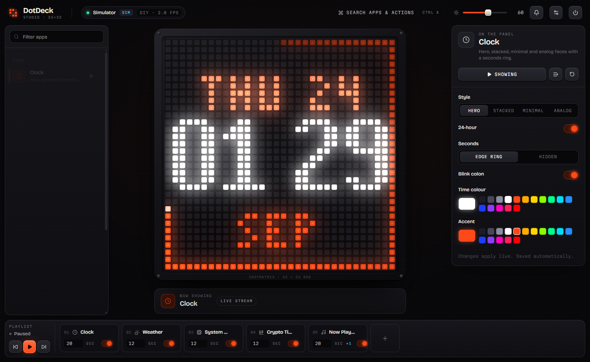

# Studio UI & UX system

The studio (`web/`) is the controller. Its centrepiece is the panel itself.



## Concept: "instrument panel"

A piece of studio hardware rather than a web dashboard: machined graphite surfaces, engraved monospace labels,
hardware keys that depress, faders like a mixing desk, and **one** accent colour — ember `#ff4818`, the same
colour as the brand LEDs. The LED preview sits in a bezel with screws, a recessed well, per-LED bloom and a
diffuser sheen, so what you see is what the panel emits.

## Tokens (`web/src/index.css` → `@theme`)

| Token | Value | Use |
| --- | --- | --- |
| `chassis-0…4` | `#08080a` → `#27272f` | page → raised controls |
| `line`, `line-2` | `#25252d`, `#33333d` | hairlines, control borders |
| `ink-1…4` | `#efece4` → `#484651` | primary text → disabled |
| `ember`, `ember-2`, `ember-deep` | `#ff4818`, `#ff7a4d`, `#3a1208` | accent, hover, active wells |
| `ok`, `warn`, `bad`, `info` | green, amber, red, cyan | status only |
| `font-display` | Bricolage Grotesque (variable) | names, headings |
| `font-mono` | Martian Mono | engraved labels, data, keys |
| radius | 14 px surfaces, 9–10 px controls, 5 px swatches | |

Fonts are bundled with `@fontsource` — the studio works fully offline.

## Components (CSS classes in `index.css`)

| Class | What |
| --- | --- |
| `.surface` | machined panel: gradient, hairline, inner top highlight |
| `.engrave` | 9.5 px mono uppercase, 0.18 em tracking, `ink-3` — every label |
| `.key`, `.key-ember`, `.key-ghost`, `.key-icon` | hardware buttons; ember = the one primary action in view |
| `.fader` | range input; set `--fill` to the percentage for the lit track |
| `.seg` | segmented control (≤ 4 options) |
| `.toggle` | switch; ember glow when on |
| `.field` | inset text/select/textarea |
| `.led[data-on=ok|warn|bad|ember]` | status dot |
| `.bezel`, `.screw` | the panel housing |

## Layout

```
┌ TopBar: wordmark · status pill · Find anything (Ctrl K) · brightness · settings · power guard ┐
├ Library (300) ┬ Stage (flex): bezel + LED panel, context tools, now-showing + Create menu ┬ Inspector (340) ┤
└ Playback dock: transport · what's playing / next · shuffle · preset cards · Edit playlist (queue) ──┘
```

- **Top bar = five controls, no more.** Status pill (panel OK? → Device settings; a retry key appears when the
  link is down), Find anything (command palette), brightness, settings, the eject-seat power guard. Everything
  else lives in the command palette or a menu: *Send a message*, *Make with AI*, *Show a picture*, *Draw* and
  *Write text* and *Show on TV* (`components/TvSheet.tsx`: QR, address, TV code, screens watching, New code, Stop TV
  link — docs/TV_VIEW.md) are in the Stage's **Create** menu; the Bluetooth link switch is in Settings → Device (with a
  warning, because the panel shows its pairing screen while disconnected).
- **One "what's playing" area.** The playback dock is the only place for rotation state: preset name or
  "Your playlist", current app + countdown + progress, *Next: …*, prev / stop / next, shuffle. Preset cards
  (icon, name, app count) play with one tap (`POST /api/presets/{id}/play`, honouring the shuffle pref); the
  active one glows ember. *Save as preset* names the current playlist; your own presets get a × with an inline
  confirm (also listed in Settings → Playlist & hand-off). *Edit playlist* expands the draggable queue.
- **Library** is grouped by category with sticky headers (Favourites first), a search with clear, a single
  scrolling row of category chips, grid/list toggle and a preview-size fader (grid only).
- **Inspector** shows the first 5 settings; the rest (and every `group`) sit behind **More options**.
- Rails are resizable but clamped (library ≤ 460 px, inspector ≤ 480 px) so the preview always stays the hero.
- ≥ 1280 px: three columns. 768–1279: Library + Stage; the Inspector opens as a right drawer (“Settings” on the
  now-showing card, or clicking an app).
- < 768 (phones) — an app shell, not a squeezed desktop (`App.tsx PhoneLayout`, `index.css` "phones" block):
  - **Header** (52 px + the notch inset): status dot, the logo, Search and one **⋯** key. Brightness, panel
    power, the fruit-fly toggle + flies-allowed sign, Device / Settings / Message live in the **Quick controls**
    bottom sheet (`TopBar.tsx QuickSheet`).
  - **Bottom tab bar** in the thumb zone — **Panel**, **Apps**, **Presets**, **Settings** — with a lit pill behind
    the active icon; tapping the open tab scrolls it to the top.
  - **One scroll area per tab** (`.phone-scroll`), never scroll boxes inside cards. `Library flat`: sticky search +
    category chips, section titles stick under them, a dense 3-up grid (4-up ≥ 520 px) with a visible ▶ per tile.
    `Inspector flat`: the live panel in its header, the form in one card, **Show / Playlist** docked above the tab
    bar. Apps and Presets keep a slim "now showing" strip on top (tap = back to the panel).
  - **Play mode** is a handheld console: score strip, the panel as big as fits, the pad — one screen, no scroll.
    Mode, match setup, restart / AI / fruit fly sit in the **Match** sheet (header ⚙ key).
  - Bottom sheets (`components/Sheet.tsx`: drag-to-close handle, ≤ 88 dvh, safe-area padding) replace pop-overs;
    modals are full-screen with the notch / home-indicator insets. `100dvh`, `viewport-fit=cover`, 16 px inputs (no
    iOS zoom), `touch-action: manipulation`, no tap flash, `overscroll-behavior` so pages never rubber-band.

## Play mode (`components/PlayMode.tsx`, `lib/gameInput.ts`)

A focused, full-window game view (`playMode` in the store) for every *playable* game — `isPlayable()`: category
`games` with the `demo` action (the `GameApp` base class), plus Snake (`arcade`). Game Deals / Trivia don't qualify.

- **Entry points:** the ember **Play** key on the stage's game bar (also `P`), the palette's *Play a game…*
  (opens the game showing, else the last one played — `lastGame` pref — else the first), and on phones the
  stage's Play key *is* the game pad. Entering from a running playlist activates the game, which pauses rotation.
- **Layout:** header = game switcher (‹ · menu of all games · ›), keyboard-focus chip, Restart, Let AI play, exit.
  Desktop: scoreboard (score / best / You-or-AI) · LED panel · control legend with keycaps (per-game meanings in
  `HINTS`; shows the bound keys and extra keyboard players). Phones (and coarse pointers in place of the legend): the
  on-screen controller (`TouchControls.tsx`). The header also has a **Controls** key and a **Display** key (see below).
- **Match setup** (`components/MatchSetup.tsx`, left column; a collapsible card on phones): Mode (segmented), Players
  (1..the mode's max, from `/api/meta` → `modes`), Map, Theme — all read from the settings schema / meta, never
  hard-coded — a big ember **Start** (`start` action; the choice is also saved as the game's settings), **Menu on
  panel** (`menu` action) and **Controllers** (opens the Controls sheet), plus the seats with each one's controller chip.
  A pill mirrors `status.flow` (AI demo · Menu on panel · Picking sides · Get ready · Playing · Results).
  During `teams` the card becomes the **side select**: Team A (`#00c8ff`) · Middle · Team B (`#ff3c5a`) columns with
  a tile per person (seat colour, controller, ready), "AI fills N seats", and ← / Ready / → keys for P1; every
  controller's ←/→ and A already reach the game. During `outro` it shows the **result** with *Rematch* (key A) and
  *Menu* (key B). On those screens (home / teams / intro / outro) keys never auto-repeat: one press = one step.
- **Display** (per browser, `lib/look.ts` → `useLook`): look (Glow / Pixel / LED) and **Sharpness** — the Glow
  look's bloom amount (`bloom` 0..1, 0 = crisp, 0.5 = the classic glow), persisted in `deskdot.panelBloom`.
- **Panel:** `LedPanel crisp` — the canvas snaps to a multiple of 32 device pixels so every LED is a whole number
  of pixels, and bloom is blurred at 4 px/LED then upscaled (a big blur at full size costs milliseconds).
  Frames are drawn in the WebSocket `onmessage` callback — no queue, no rAF batching.
- **Keys:** Play mode owns the keyboard (capture-phase listener; `App` shortcuts step aside). Game keys
  `preventDefault` (no scrolling, Space/Enter never click a focused button); `R` restart · `[` `]` prev/next ·
  `Esc` closes the games menu, then Play mode. Ctrl/Alt/⌘ combos stay the browser's. When the window loses focus
  the panel shows "Click to play — keys are paused".
- **Input feel:** `pressKey/releaseKey` send on press, then repeat on our own timer (OS repeat events are ignored;
  keyboard, gamepads and touch share the controller, held per (player, key) so two sources on one player never
  double-send, and the legend / pad light up while held — at least 90 ms per tap). A stick past its dead zone counts
  as held; deeper deflection shortens the repeat by up to 50 % in racers (Racer, Street Surge, Neon Heat) and 30 % in
  Pong / Breakout.
  Default arrows 170 ms delay then every 65 ms; per-game profiles in `PROFILES`: Tetris ←/→ 150/50, ↓ 110/40
  (rotate & hard drop never repeat); paddles 90/45; cursors (X and 0, Mines) 240/115; Racer lanes 240/160;
  held fire 220/190; Snake, Maze, 2048, Flappy, Dino: no repeat. Keys release on window blur or app change.
- **Local players & controllers** (`lib/controls.ts`, `lib/gamepads.ts`, `components/ControlsPanel.tsx`,
  `components/TouchControls.tsx`): the header's **Controls** key opens a side sheet with one card per seat
  (P1..P{`max_players`}, seat colour, devices, a live last-input light, human/AI from `status.seats`). Per player:
  - *Keyboard* — presets by physical key (`KeyboardEvent.code`): **Arrows + Space/Shift** (P1 default; Enter is also A,
    and W A S D also steer while nobody else is on the keyboard), **W A S D + F/G**, **I J K L + H/;**, or **Custom**
    (click a slot, press a key; Esc cancels, Backspace clears). Keys bound twice, or that shadow `R` `[` `]` `Esc`, are
    listed in red; a doubly-bound key drives its first owner. *Two on one keyboard* = P1 W A S D + F/G, P2 arrows.
  - *Gamepad* (Gamepad API; localhost is a secure context) — connected pads listed with brand glyphs (Xbox A/B,
    PlayStation ✕/○, Nintendo positional note, generic otherwise), their player (or Off), and a rumble test. An unknown
    pad joins as the lowest player without a pad on its first button press (that press is swallowed); assignments are
    remembered by pad id, so a replugged pad gets its player back. Standard mapping: d-pad and left stick → directions
    (dead-zone slider, dominant axis with hysteresis), A/✕ → a, B/○ → b, X/Y/shoulders/triggers alternates, Start →
    restart, Select → let AI play. Non-standard pads also use axes 6/7 as a d-pad. Rumble (toggle) on a life lost, game
    over (score back to 0) or a round won. Polling is `requestAnimationFrame` only while Play mode is open and a pad is
    connected; otherwise a 1 s scan plus `gamepadconnected`/`disconnected`.
  - *On-screen* — for touch screens (P1 automatically on coarse pointers; any player can switch it on): **D-pad**,
    **Joystick** (floating thumbstick, dead zone, 4- or 8-way), **Swipe** (swipe to move, hold to repeat, tap = A) or
    **Tap zones** (hold left/right half + A/B). Style per game, defaulting to the game's first touch entry in `controls`.
  Input for player N goes out as `{"type":"input", app, key, player: N}` (N > 1 only); single-player games fold every
  player onto seat 1, multiplayer games drop players beyond their seats. Everything persists in `deskdot.controls`.
  A "What works" note: keyboards and pads connect to this laptop (USB/Bluetooth); friends' phones join by QR; a
  controller paired to a friend's phone is limited by its browser on plain http — use on-screen controls or the laptop.
- **Honesty note:** "The panel shows ~6–9 fps over Bluetooth; this view is smoother." plus measured view fps and
  the panel's `link_fps`.

### Friends on the same Wi-Fi (`components/Multiplayer.tsx`, `lib/qr.ts`)

Games with `max_players > 1` (listed by `GET /api/play/lobby` → `games`) get a **vs AI / Play with friends** choice
above the scoreboard. *Play with friends* (also the palette's *Play with a friend…*) calls `POST /api/play/lobby`;
while `status.lobby` is true the right column (below the panel on phones) is the **lobby**: the join QR code
(`lib/qr.ts`, a local byte-mode encoder, level L, drawn as crisp SVG with a quiet zone — same URL as the panel's),
the URL to type (click to copy), the room code, one slot per seat in its seat colour (1 `#00c8ff` host, 2 `#ff3c5a`,
3 `#50ff78`, 4 `#ffc800`) filling in as phones join, *Start now* (`/lobby/start`, empty seats → AI) and *Cancel*
(`DELETE`). A red fix-it box appears when `lan_ready` is false (host must be `0.0.0.0`), and a note says friends need
the same Wi-Fi and Windows may ask to allow network access the first time.

While playing: the versus board (X vs O wins + draws for tic-tac-toe, a seat list otherwise), a *Your turn / Their
turn / AI's turn* pill from `status.turn`, a *N friends connected* pill with seat dots in the header, and *End friend
game* in place of *Let AI play*. Switching games closes the room. Seat joins show up instantly via `status.seats` on
the state stream; `/api/play/lobby` is polled only while Play mode is open (700 ms while waiting, 2.5 s otherwise) and
written to the store only when it changed (`lobby`, `lanReady`, `mpGames`).

### Casino mode (`components/casino/`)

When a casino game (category `casino`) is on the panel the studio becomes the host's table (docs/CASINO.md §6 and
"Studio casino mode" in §8): the drawers shut, the panel sits on felt inside a marquee of chasing bulbs, and two
resizable wings open — **left** Tables (game picker with previews) · House (presets, base credits, limits, timers,
auto-next, new session) · Rules (from the schema) · Odds (exact house edge per bet, slot RTP); **right** Players
(seats, live credits, top-up / set / kick, everyone) · Ranking · Rounds (history + Verify) · Play (the host seat's
chip rack and bets). Centre: title + round + commitment hash, the host bar (phase, countdown ring, Start / Next
round, Lock now, Pause; the result replaces the phase on a result) and the room strip (open, QR, code, Hide QR,
close). Below ~980 px of stage width the wings become two tabs under the table. Gold replaces ember inside `.cz`.

## Intro & outro (`components/Boot.tsx`, `components/boot/`, `lib/intro.ts`)

Plays while the studio connects (engine → app catalogue → first state) and comes back as the outro when the engine
goes away for 2.5 s. The theme is per browser (`deskdot.intro` in localStorage), picked in Settings → Display &
colour → *Intro & outro* (`INTRO_THEMES` in `lib/intro.ts` drives that list); *Play it now* fires
`deskdot:replay-intro`.

| Theme | id | What happens |
| --- | --- | --- |
| Sunset (default) | `sunset` | synthwave sky, striped sun, neon grid; the sun flares, a crack of light splits the scene and the halves glide apart 50/50 |
| Circuit | `circuit` | a sealed LED-matrix face with traces; a power-surge ring, a crack, the halves slide apart |
| Coin Gate | `coin` | an arcade cabinet: the neon logo in a backlit marquee, a coin door (INSERT COIN display, backlit slot, service lock, coin return, CREDIT counter, chase bulbs). A silver coin spins in, turns edge-on, knocks the rim and drops in; the slot light runs down the mech, the bulbs chase, CREDIT 0 → 1. Opening: lock bolts retract with a clunk, the gate strains, then the toothed halves grind apart (gears turn, slight shake, motion blur). Outro: the halves slam shut, the bolts shoot home, the door waits for the next coin |
| OG | `og` | the original LED fly-in of the DESKDOT wordmark, then a fade |
| Off | `off` | the progress only, then a quick fade |

Rules for a theme (a class with `left`, `open`, `idle`, `resize()`, `slide(0 | 1)`, `frame(dt)` and optionally
`arm()`, called when the engine is in — Coin Gate drops its coin only then):
- Canvas 2D, `devicePixelRatio` capped at 1.5, static layers pre-rendered per size; a frame only draws what moves.
- The logo is `NeonLogo` (`lib/logo.ts`). Its pitch on phones (`w < 640`) is computed from the width so the sign
  (and its frame) is never wider than the screen; a gap between LED columns falls exactly on the split.
- Flashes stay tasteful: `flare` is a short lift of the tubes and their cores — never a bigger or brighter additive
  halo (the halos overlap neighbouring dots and wash the logo into one blur). Keep any light behind the logo modest.
- `prefers-reduced-motion`: Coin Gate skips the flight, the shake and the blur and fades the gate instead of sliding.
- Sounds through `sfx()`: `door-open` / `door-close` / `logo-buzz` (Sunset, Circuit); `coin-insert` → `coin-drop` →
  `coin-roll`, `gate-unlock` → `gate-open`, `gate-close` and `logo-buzz` (Coin Gate).
- New theme: add it to `IntroTheme` / `INTRO_THEMES`, `MIN_INTRO_MS` and the scene switch in `Boot.tsx`.

## Sound (`web/src/lib/sound.ts`)

The studio has its own small sound set. **Every effect is synthesized live with the Web Audio API** — oscillators,
one shared white-noise buffer, biquad filters and gain envelopes. No audio files, nothing sampled or copied, no
dependencies. It is a studio feature (per browser), separate from the panel's *sound input* (Settings → Device).

```ts
import { sfx } from "../lib/sound";
sfx("chip");                                  // play one effect
sfx("fly-buzz", { pan: -0.4, volume: 0.5 });  // stereo pan −1…1, volume 0…1 (× master)
```

- **Autoplay:** the `AudioContext` is created and resumed on the first `pointerdown` / `keydown` / `touchstart`
  (later gestures revive a suspended one). Calls before that are dropped silently — except the latest one, which
  still plays if the unlocking gesture comes within 300 ms of it (the intro may call before any gesture).
- **Preferences** (`localStorage["deskdot.sound"]`, try/catch): on/off, master volume (default 60 %, squared for a
  perceptual curve), four categories — **Interface**, **Casino**, **Intro & outro**, **Games & fly** — and
  *Quiet when the tab is in the background* (default on: hidden tabs are silent and the master fades out).
  `getSound()` / `setSound(patch)` / `onSound(listener)`; Settings → Display & colour → **Sound** edits them (toggle,
  volume, category switches, Test, and a picker to play any effect).
- **Manners:** at most 12 voices (the oldest fades out), a minimum gap per effect (chips 40 ms, clicks 35 ms, score
  70 ms, the fly 6 s…), a compressor as a safety limiter, interface sounds mixed deliberately quiet.
  `stopSfx(name?)` cuts a long effect (a wheel when the result lands early); `recentlyPlayed(name, ms)` lets a watcher
  avoid doubling a sound a key already made. Opt an element out of the click tick with `data-sfx="off"`, or give it
  another effect: `data-sfx="chip"`.
- **Adding an effect:** add the name to `SfxName` (never rename or remove one — other code calls them), its category
  in `CAT`, an optional gap in `GAP`, and a function in `FX` built from the `Synth` kit (`tone`, `noise`, `metal`,
  `click`, `thump`, `arp`) that returns its duration.

### Effects

| Category | Effect | What it is |
| --- | --- | --- |
| Intro | `boot-hum` | mains hum swelling (50 + 100 Hz saws, low-passed) |
| | `door-open` / `door-close` | bolt clunk + pneumatic hiss (and the reverse) |
| | `logo-buzz` | a neon tube striking: 120 Hz buzz gated by flicker |
| | `coin-insert` | a silver coin: bright inharmonic clink, short ring, a bounce, the slide down the chute, a soft landing |
| | `coin-drop` / `coin-roll` | bouncing clinks closing up · a coin rolling on its edge, then the settling whirr speeding up |
| | `gate-unlock` | latch click, bolt slide, deep clunk |
| | `gate-open` / `gate-close` | rolling shutter: slat rattle at a changing rate, rumble and motor, end-stop clunk |
| Interface | `click` `tab` `toggle` | soft ticks (keys, tabs / segmented controls, switches) |
| | `sheet-open` / `sheet-close` | a filtered-noise swish up / down |
| | `toast` `success` `error` | two-note chime · rising triad · two low notes |
| | `app-switch` `playlist-next` `playlist-prev` | blip-swish · swish up / down + tick |
| Casino | `chip` `chips-stack` | clay chips knocking (one, or a handful) |
| | `round-open` `no-more-bets` | a desk bell · a two-tone bell (high, low) |
| | `wheel-spin` `ball-drop` | whoosh + ratchet ticks spreading out over ~4 s · the ball skittering into a pocket |
| | `card-deal` `card-flip` | swish across the felt + snap · flip snap |
| | `dice-roll` `reel-spin` `reel-stop` | hard clacks over a felt rumble · reel ratchet whirr · mechanical thunk |
| | `win` `big-win` `lose` | short major arpeggio · a double arpeggio + coins · a soft falling pair |
| | `bingo-call` `bingo-win` `tick` | a bell ding · bell + arpeggio · a countdown tick |
| Games | `game-start` `game-over` `score` | soft square-wave arpeggio up · down with vibrato · a two-note blip |
| | `fly-buzz` | ~200 Hz wing buzz with a wobbling pitch, fading in and out, panned to where the fly is |

### Trigger points

Every place in the project where a sound belongs. **Wired** = calls `sfx` today; **suggested** = a good place, not
wired yet. The phone pages and the panel itself can't reach the studio's audio: a phone page needs its own small copy
of the synthesizer, and panel-side events are best voiced by the studio when it sees them in the state stream.

| Where | Event | Effect | Status |
| --- | --- | --- | --- |
| Studio — any key, button, library tile (`lib/studioSound.ts`, one delegated click listener) | press | `click` | wired |
| Studio — tab bar, category chips, segmented controls, settings sections | select | `tab` | wired |
| Studio — every switch (`role="switch"`) | flip | `toggle` | wired |
| Studio — `Sheet` / `Modal` (settings, dialogs, Quick controls, Match…) | open / close | `sheet-open` / `sheet-close` | wired |
| Studio — toasts (`store.toast`) | info / ok / error | `toast` / `success` / `error` | wired |
| Studio — the app on the panel changes (state stream) | switch | `app-switch` | wired |
| Studio — playback dock ‹ › | previous / next | `playlist-prev` / `playlist-next` | wired |
| Studio — ← / → keys (playlist) | previous / next | `app-switch` (from the change) | wired |
| Studio — Play mode (`status.flow`, `status.score`) | flow → `play` · flow → `outro` or score back to 0 · score up | `game-start` · `game-over` · `score` | wired |
| Studio — fruit-fly view opens (`openFlyView`) | open | `fly-buzz` | wired |
| Studio — the roaming fly (`RoamingFly.tsx`) | swatted · now and then near the cursor | `fly-buzz` (panned) | wired |
| Studio casino (`components/casino/sounds.ts`, from the public status) | casino mode entered (chip cascade) | `chips-stack` | wired |
| | anyone's chips go down (totals rise) / come off | `chip` · `chips-stack` (≥ 5 × min bet) | wired |
| | betting opens · last 3 s · lock | `round-open` · `tick` · `no-more-bets` | wired |
| | reveal: roulette & Big Six · slots · Sevens · card games | `wheel-spin` · `reel-spin` · `dice-roll` · 4 × `card-deal` | wired |
| | players' turn (Hold'em, Teen Patti) | `card-flip` | wired |
| | result: wheel · slots · cards, then winners / nobody | `ball-drop` · 3 × `reel-stop` · `card-flip`, then `win` / `big-win` (≥ 10 × min bet) / `lose` | wired |
| Studio — device link drops / comes back | lost / connected | `error` / `success` | suggested |
| Studio — multiplayer lobby (`Multiplayer.tsx`) | a friend joins / leaves | `chip` / `sheet-close` | suggested |
| Studio — Play mode lives lost (`status.lives`, as rumble reads it) | hit | a new `hit` effect | suggested |
| Intro / outro themes (`components/boot/*`) | doors open / close · logo lights | `door-open` / `door-close` · `logo-buzz` | wired in Sunset and Circuit |
| | Coin Gate: coin enters the slot · falls · rolls · bolts retract · gate moves · gate slams shut · logo lights | `coin-insert` · `coin-drop` · `coin-roll` · `gate-unlock` · `gate-open` · `gate-close` · `logo-buzz` | wired |
| | engine reachable | `boot-hum` | suggested (effect ready) |
| Phone casino page (`src/deskdot/casino.html`) | tap a chip / spot · Done · your win / loss · your turn | `chip` · `click` · `win` / `lose` · `tick` | suggested (needs its own synth) |
| Phone controller (`src/deskdot/controller.html`) | button press · joined · game over | `click` · `success` · `game-over` | suggested (keep optional: friends sit in the same room) |
| Panel-side events (notifications, On Air, eye break, timers / Pomodoro, alarms, ntfy pushes, Home Assistant) | shown on the panel | `toast`, or a chime per kind | suggested |
| Bingo-style apps (if one is added) | number called · line | `bingo-call` · `bingo-win` | suggested (effects ready) |

## Settings

Four sections, each a stack of titled blocks with an anchor id `set-<block>`:

| Section | Blocks |
| --- | --- |
| Display & colour | display (brightness, night mode, rotate) · `intro` intro & outro theme · `sound` studio sounds · `calibrate` colour calibration (`components/calibration/`: guided A/B match, presets, advanced) · `transfer` motion lab (guided A/B, test bench, presets, auto-tune, advanced + fixed link facts) — see docs/CALIBRATION.md |
| Notifications & integrations | `notifications` computer alerts · `integrations`: On Air, eye break, status indicators, phone pushes (ntfy), Home Assistant |
| Playlist & hand-off | transitions · your presets · `autopilot` "Follow the app I'm using" · `handoff` "Keep showing when my computer is off" |
| Device | `panel` connection (reconnect, scan, disconnect…) · `weather` location & units · `audio` sound input · data sources |

`openSettings(tab)` / `settingsTab` accepts a section **or** a block id (the old tab names), and the sheet scrolls
to and flashes that block. The search box in the header matches labels and synonyms (`INDEX` in `Settings.tsx`) —
add an entry when you add a setting.

## Interaction principles

1. **Direct manipulation first.** Paint on the panel preview itself; drag files anywhere to show them;
   drag playlist cards to reorder.
2. **Live by default.** Settings apply as you move a fader (coalesced into one PATCH per 160 ms). No save buttons.
3. **One primary action per view** (ember key): *Show on panel* in the inspector, *Send* in the composer.
   Labels are plain language ("Plays by itself", not "Native loop"); every empty state says what to do next;
   destructive actions (delete preset, reset defaults, disconnect) confirm inline — never `window.confirm`.
4. **Optimistic but honest.** Canvas strokes echo locally before the round-trip; errors from the API always
   surface as a toast with the server's message.
5. **Keyboard complete.** `Ctrl/⌘ K` palette · `1–9` show app · `←/→` playlist · `N` notify · `P` Play mode (games) ·
   canvas `B` brush `E` eraser `F` fill `I` pick · `Esc` closes.
6. **Explain the machine.** Each app shows its output kind (Live stream / Native loop / Firmware) with a tooltip;
   the device pill shows panel mode and link fps; Settings shows frames sent/dropped and provider health.
7. **Never block.** Every request is fire-and-forget with a toast on failure; the WebSocket reconnects forever
   with backoff and the pill says so.

## Schema-driven forms

The Inspector renders any app's pydantic schema (`SchemaForm.tsx`):

| Schema | Control |
| --- | --- |
| `enum` ≤ 4 (from `Choice`) | segmented |
| `enum` > 4 | select |
| `boolean` | toggle |
| `integer/number` with `minimum`+`maximum` | fader + readout |
| `format: "color"` (`Color` type) | swatch + picker with LED palette tokens |
| `format: "media"` | media library grid with upload |
| string, `maxLength > 80` | textarea (commit on blur / Ctrl-Enter) |
| string | input (commit on blur / Enter) |

Grouped fields (`group`) sit in collapsible blocks; games order them **Game · Graphics · Game flow** with an icon each.
A segmented option labelled like `Full (particles, shake, flashes)` shows the short name on the key and the part in
brackets as a hint under the control.

To get a new control type: add a `json_schema_extra={"format": "..."}` in Python and a branch in `SchemaForm`.

## Performance rules

- Frames never go through React state. `lib/store.ts` keeps them in a module variable; `LedPanel` subscribes
  and draws on a canvas. Bloom = the 32×32 frame upscaled with blur and `lighter` compositing (two passes).
- Zustand selectors must return stable references (`EMPTY_LIST`/`EMPTY_MAP`, never `?? []`) — v5 throws on
  unstable selectors.
- Animations are CSS; long lists use `overflow` containers, not virtualisation (n is small).
- Loading states use the `.skeleton` shimmer (library cards, presets, inspector, hand-off); library previews fade
  in when their lazy GIF loads.
- Presets are fetched once into the store (`presets`, `null` until loaded) and refreshed by `loadPresets()`
  after a save or delete; the active one comes from `engine.active_preset` in the state stream.

## Accessibility

- Visible focus ring (ember outline) on every control; all icon-only keys have `title`/`aria-label`.
- Toggles are `role="switch"` with `aria-checked`; dialogs have `role="dialog"`; the preview is `role="img"`.
- `prefers-reduced-motion` disables animations and transitions.
- Colour is never the only signal (status dots come with text).
